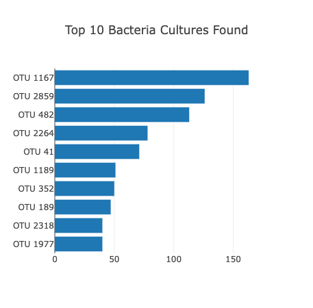
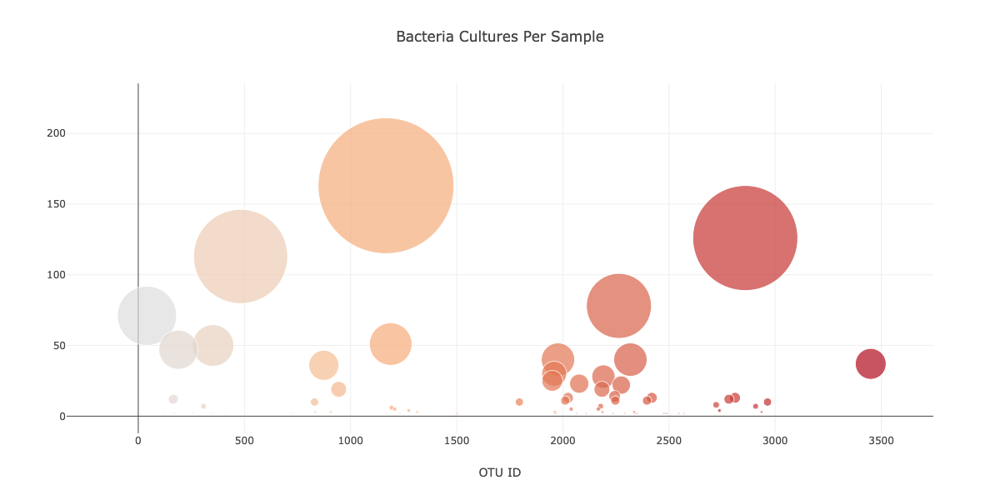
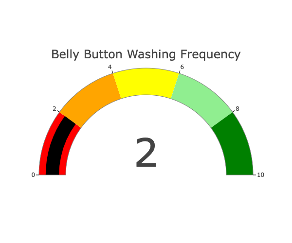

# Bellybutton Diversity

## Overview of Project
The purpose of this project is to create a dashboard with a panel for demographic information and visualizations for the bacterial data for each volunteer. Specifically, the volunteers should be able to identify the top 10 bacterial species in their belly buttons. That way, if Improbable Beef identifies a species as a candidate to manufacture synthetic beef, Roza's volunteers will be able to identify whether that species is found in their navel.

## Summary
Using my knowledge of JavaScript, Plotly, and D3.js, I create a horizontal bar chart to display the top 10 bacterial species (OTUs) when an individual’s ID is selected from the dropdown menu on the webpage. The horizontal bar chart displays the sample_values as the values, the otu_ids as the labels, and the otu_labels as the hover text for the bars on the chart.

Here is an image of the completed horizontal bar chart:

Next, I create a bubble chart that displays the following when an individual’s ID is selected from the dropdown menu webpage:

- The otu_ids as the x-axis values.
- The sample_values as the y-axis values.
- The sample_values as the marker size.
- The otu_ids as the marker colors.
- The otu_labels as the hover-text values.

Here is an image of the completed bubble chart:

Finally, I create a gauge chart that displays the weekly washing frequency's value, and display the value as a measure from 0-10 on the progress bar in the gauge chart when an individual ID is selected from the dropdown menu.

Here is an image of the completed gauge chart:

To customize the Dashboard, I have used my knowledge of HTML and Bootstrap to customize the webpage for the dashboard with the folloiwng components:

1. Added a css stylesheet with a background image for the jumbotron.

2. Added more information about the project as a paragraph underneath the jumbotron on the page.

3. Used italicized text for the instructions to use the interactive charts to explore the dataset.

The completed working example is available as a Github page here.